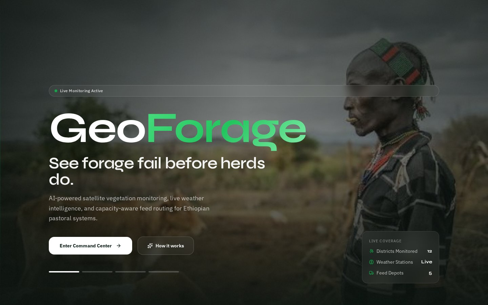
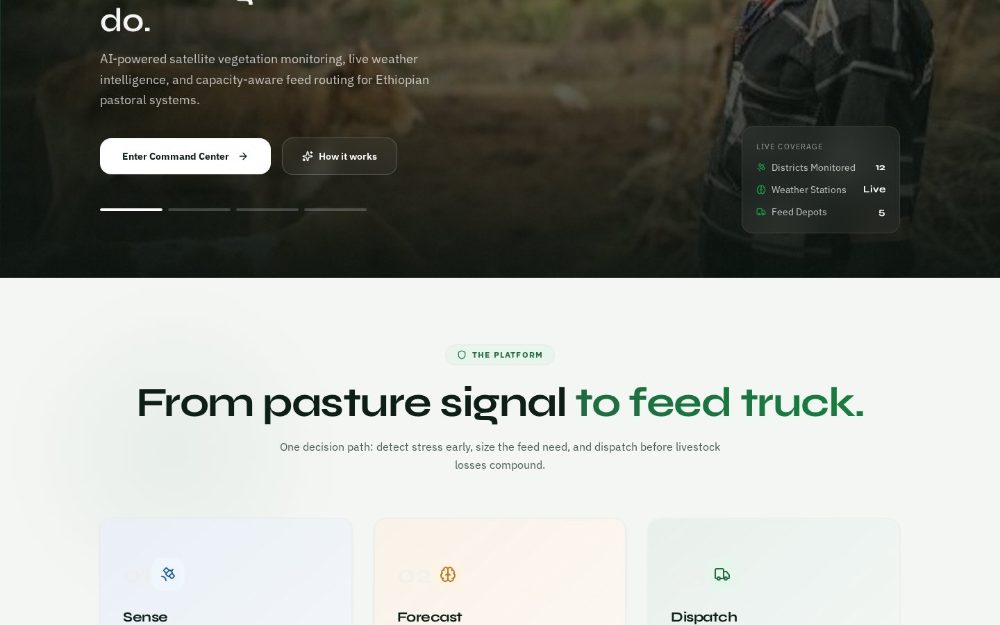
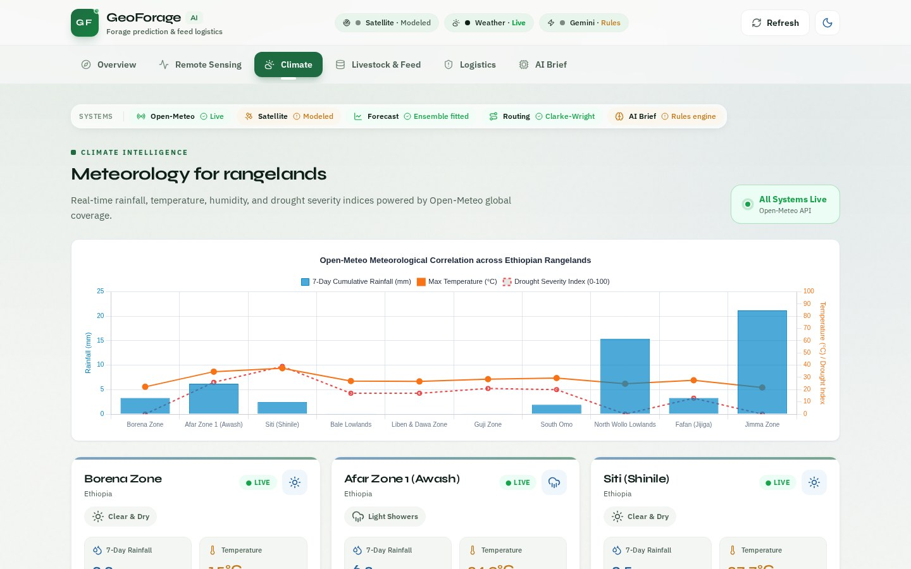
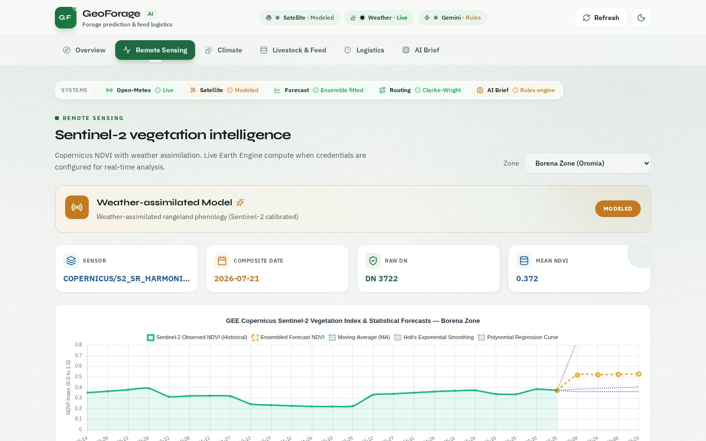
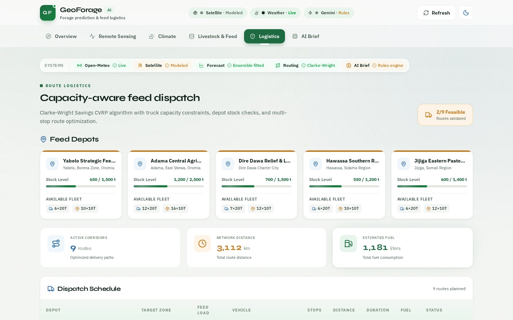
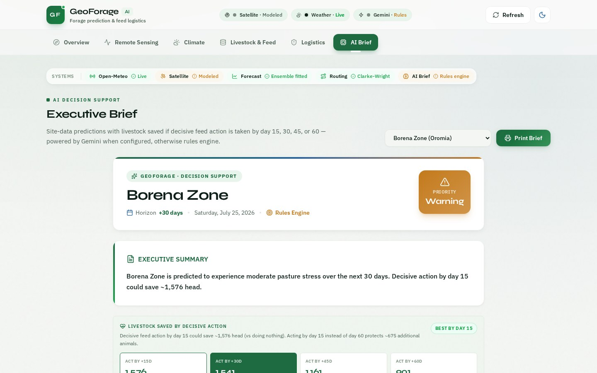
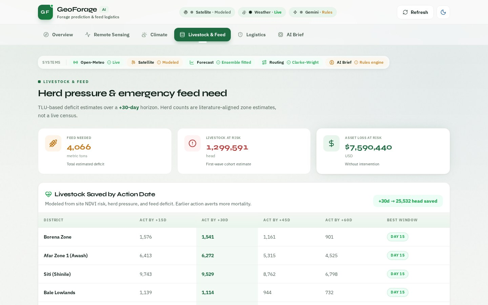

<p align="center">
  
  
  
  
  
  
</p>

<p align="center">
  
  
  
  
</p>

<br>

<div align="center">

# መስክAI

### *AI-Powered Ethiopian Pastoral Forage Prediction & Livestock Management Platform*

**Transforming pastoral resilience through satellite intelligence, machine learning, and logistics optimization**

[Live Demo](#quick-start) • [Documentation](#features) • [Screenshots](#features) • [Team](#team-contributors) • [Contributing](#contributing)

</div>

<br>

---

## Quick Navigation

| Section | Description |
|---------|-------------|
| [About](#about-መስክai) | What is መስክAI and why it matters |
| [Features](#features) | Complete feature breakdown with screenshots |
| [Tech Stack](#tech-stack) | Technologies powering the platform |
| [Architecture](#system-architecture) | How components work together |
| [Team](#team-contributors) | Meet the contributors |
| [Quick Start](#quick-start) | Run locally in 2 minutes |
| [Security](#security) | Security practices |
| [Roadmap](#roadmap) | Future plans |

---

## About መስክAI

**መስክAI** is an enterprise-grade, AI-powered platform designed specifically for **Ethiopian pastoral communities** facing climate-induced forage scarcity. By leveraging **Sentinel-2 satellite imagery**, **Google Earth Engine**, **machine learning models**, and **optimization algorithms**, መስክAI delivers real-time forage predictions, livestock management insights, and intelligent feed dispatch routing.

### The Problem We Solve

Ethiopia's pastoral regions support **millions of livestock** and livelihoods, yet face:

- **Unpredictable drought cycles** causing massive livestock mortality
- **Lack of real-time forage data** for migration decisions  
- **Inefficient emergency feed logistics** reaching affected areas too late
- **Fragmented information** across weather, satellite, and ground data

### Our Solution

መስክAI provides a **unified command center** with:

| Capability | Impact |
|------------|--------|
| **Satellite NDVI Monitoring** | Real-time vegetation health across all zones |
| **AI-Powered Predictions** | 60-day forage outlook using Gemini AI |
| **Climate Analytics** | Temperature, precipitation, drought indexing |
| **Route Optimization** | Clarke-Wright CVRP algorithm for feed dispatch |
| **Executive Briefs** | Auto-generated decision reports for policymakers |

---

## Features

### 1. Landing Page - Hero Section



Full-screen cinematic hero with parallax effects, gradient text logo ("መስክ"), and compelling call-to-action buttons. Shows live monitoring status and coverage statistics.

---

### 2. Landing Page - Platform Features



Interactive feature cards showcasing the three core capabilities: **Sense** (Sentinel-2 NDVI + Open-Meteo rainfall), **Forecast** (Ensemble models for forage risk at 15/30/45/60 days), and **Dispatch** (Clarke-Wright routing for feed logistics).

---

### 3. Executive Dashboard (/overview)


Complete command center overview featuring:
- **KPI Header** -- Avoidable loss ($7.6M), zones monitored (10), critical alerts (2)
- **Statistics Grid** -- 6 animated cards: Zones, Critical, Feed Deficit, At Risk, Mean NDVI, Loss at Risk
- **Projection Timeline** -- Interactive 60-day slider (Today / +15d / +30d / +45d / +60d / Seasonal)
- **Situational Awareness** -- Live Leaflet map with district overlays and priority zone panel

---

### 4. Climate Analytics (/climate)



Meteorological intelligence dashboard powered by Open-Meteo global coverage:
- **Correlation Chart** -- 7-Day Cumulative Rainfall, Max Temperature, Drought Severity Index across all zones
- **Zone Weather Cards** -- Per-district conditions (Borena Zone, Afar Zone, Siti/Shinile) with live status
- **Metrics** -- Rainfall totals, temperature readings, weather icons per zone

**Climate Data Sources:** Open-Meteo API with real-time rainfall, temperature, humidity, and drought severity indices.

---

### 5. Satellite Monitoring (/satellite)



Sentinel-2 vegetation intelligence via Google Earth Engine:
- **Weather-Assimilated Model** -- Rangeland phenology calibrated with Sentinel-2
- **Sensor Metadata** -- COPERNICUS/S2_SR_HARMONIZED, composite dates, raw DN values
- **NDVI Forecast Chart** -- Historical observed NDVI + Ensemble forecast + Moving Average + Holt's Exponential Smoothing + Polynomial Regression
- **Zone Selector** -- Dropdown to switch between monitoring zones

**Satellite Features:** 10m resolution multispectral imagery, NDVI calculation, cloud-free compositing, trend analysis.

---

### 6. Logistics & Route Optimization (/logistics)



Capacity-aware feed dispatch using Clarke-Wright Savings CVRP algorithm:
- **Feed Depots** -- 5 strategic locations (Yabelo, Adama, Dire Dawa, Hawassa, Jijiga) with stock levels and fleet availability
- **Network Summary** -- 9 active routes, 3,112 km total distance, 1,181 liters estimated fuel
- **Dispatch Schedule Table** -- Depot, target zone, feed load, vehicle type, stops, distance, duration, fuel, status
- **Validation Badge** -- "2/9 Feasible Routes validated"

**Optimization Constraints:** Truck capacity (6T-20T, 10T-10T fleets), depot stock checks, multi-stop routing.

---

### 7. AI Brief Generator (/ai-brief)



Executive decision support briefs powered by Google Gemini AI:
- **Zone Brief Header** -- Borena Zone, +30 day horizon, date, Rules Engine source
- **Priority Warning Badge** -- Color-coded alert (Warning/Critical/Normal)
- **Executive Summary** -- Plain-language prediction ("moderate pasture stress... decisive action by day 15 could save ~1,576 head")
- **Livestock Saved Comparison** -- Action-by +15d / +30d / +45d / +60d with "BEST BY DAY 15" highlight
- **Print Brief Button** -- Export-ready formatting

**AI Fallback:** Deterministic rules engine when Gemini API is unavailable.

---

### 8. Livestock Management (/livestock)



Herd pressure and emergency feed need assessment:
- **Summary Cards** -- Feed Needed (4,066 metric tons), Livestock at Risk (1,299,591 head), Asset Loss at Risk ($7.59M USD)
- **Action Date Table** -- Per-district livestock saved by intervention timing (+15d / +30d / +45d / +60d) with best window recommendation
- **Zone Breakdown** -- Borena Zone, Afar Zone 1, Siti (Shinile), Bale Lowlands with TLU-based deficit estimates
- **Impact Metric** -- "+30d -> 25,532 head saved" banner

**Data Source:** Literature-aligned zone estimates (not live census), modeled from site NDVI risk and herd pressure.

---

## Tech Stack

### Frontend

| Technology | Version | Purpose |
|------------|---------|---------|
|  | 19.x | UI Library |
|  | 5.7.x | Type Safety |
|  | 6.x | Build Tool |
|  | 4.x | Styling |
|  | 11.x | Animations |
|  | 1.9.x | Maps |
|  | 2.x | Charts |

### Backend

| Technology | Version | Purpose |
|------------|---------|---------|
|  | 22.x | Runtime |
|  | 5.x | Server Framework |
|  | API | Satellite Data |
|  | API | AI Analysis |
|  | API | Weather Data |

### Design System

```
+-- Color Palette
|   +-- Field Green    (#22C55E) -- Healthy vegetation
|   +-- Signal Orange  (#F97316) -- Warning/Attention
|   +-- Critical Red    (#EF4444) -- Danger/Urgent
|   +-- Sky Blue        (#0EA5E9) -- Information/Water
|   +-- OK Green        (#84CC16) -- Success/Normal
|
+-- Glass Morphism
|   +-- Backdrop Blur   (12px)
|   +-- Semi-transparent backgrounds (rgba)
|   +-- Subtle borders  (1px solid rgba)
|
+-- Animations
    +-- Fade Up         (entrance)
    +-- Scale In        (modal)
    +-- Gradient Shift  (hero)
    +-- Shimmer         (loading)
    +-- Pulse Ring      (live indicators)
```

---

## System Architecture

```
+-------------------------------------------------------------------------+
|                         CLIENT LAYER                                    |
|  +----------+ +-----------+ +----------+ +----------------------+       |
|  | React    | | Tailwind  | | Framer   | |     Recharts         |       |
|  | 19 + TS  | |   CSS 4   | |  Motion  | |   Visualization      |       |
|  +----+-----+ +-----+-----+ +----+-----+ +-----------+----------+       |
|       +--------------+----+-------------------+                       |
|                      V    V                                           |
|              +-------------------------------+                        |
|              |      Leaflet Maps             |                        |
|              |   (6 Basemap Layers)          |                        |
|              +---------------+---------------+                        |
+------------------------------+----------------------------------------+
                               | HTTP/REST
+------------------------------V----------------------------------------+
|                          API LAYER                                     |
|  +---------------------------------------------------------------+     |
|  |                    Express.js Server                           |     |
|  |  +----------+ +----------+ +----------+ +---------------+      |     |
|  |  | /climate | |/satellite| |/logistics| | /ai-brief     |      |     |
|  |  +----+-----+ +----+-----+ +----+------+ +-------+-------+      |     |
|  +-------+------------+------------+---------------+--------------+     |
+----------+------------+------------+---------------+--------------------+
           |            |            |               |
+----------V------------V------------V---------------V--------------------+
|                        SERVICE LAYER                                   |
|  +------------------+  +------------------+  +---------------------+   |
|  |  geeService      |  | weatherService   |  |   aiAnalyzer        |   |
|  |  (Sentinel-2)    |  | (Open-Meteo)     |  |   (Gemini AI)       |   |
|  +------------------+  +------------------+  +---------------------+   |
|  +------------------+  +------------------+  +---------------------+   |
|  | forecasting      |  | feedEstimator    |  |  routeOptimizer      |   |
|  | (NDVI Predict)   |  | (Requirements)   |  |  (CVRP Algorithm)   |   |
|  +------------------+  +------------------+  +---------------------+   |
+-------------------------------------------------------------------------+
           |            |            |
+----------V------------V------------V------------------------------------+
|                        EXTERNAL APIS                                   |
|  +------------+  +------------+  +------------+                         |
|  | Google EEE |  | Open-Meteo |  | Gemini AI  |                         |
|  | (Satellite)|  | (Weather)  |  |  (LLM)     |                         |
|  +------------+  +------------+  +------------+                         |
+-------------------------------------------------------------------------+
```

---

## Team Contributors

<div align="center">

| Role | Name | Location | Focus Area |
|------|------|----------|------------|
| **Frontend Lead** | Zeamanuel Million | Addis Ababa, ET | React, TypeScript, UI Components |
| **UI/UX Designer** | Bekan Seifu | Addis Ababa, ET | Design System, Glass Morphism, Animations |
| **AI/ML Engineer** | Elshaday Habtamu | Addis Ababa, ET | GEE Integration, NDVI Models, Gemini AI |
| **Backend Engineer** | Abdi Megersa | Addis Ababa, ET | Express.js, APIs, Route Optimization |
| **Product/Other** | Dawit Getachew Tariku | Addis Ababa, ET | Documentation, Testing, Coordination |

</div>

<p align="center">
  
  
  
</p>

---

## Quick Start

### Prerequisites

- **Node.js** >= 18.0.0
- **npm** >= 9.0.0
- **Git**

### Installation

```bash
# Clone the repository
git clone https://github.com/Hope0351/mesek-AI.git
cd mesek-AI

# Install dependencies
npm install

# Set up environment variables
cp .env.example .env
# Edit .env with your API keys

# Start development server
npm run dev
```

### Environment Variables

| Variable | Description | Required |
|----------|-------------|----------|
| `GEMINI_API_KEY` | Google Gemini AI API key | Yes |
| `GEE_PROJECT_ID` | Google Earth Engine project ID | Yes |
| `GEE_PRIVATE_KEY` | GEE service account key | Yes |
| `OPEN_METEO_URL` | Open-Meteo base URL | No (has default) |
| `PORT` | Server port | No (default: 3000) |

### Available Scripts

```bash
npm run dev       # Start development server (port 3000)
npm run build     # Build for production
npm run start     # Start production server
npm run lint      # Run ESLint
npm run preview   # Preview production build
```

### Docker (Optional)

```bash
docker build -t pastureai .
docker run -p 3000:3000 --env-file .env pastureai
```

---

## Project Stats

<p align="center">
  
  
  
  
</p>

### Code Metrics

| Category | Count |
|----------|-------|
| React Components | 15+ |
| Pages/Routes | 7 |
| Backend Services | 8 |
| CSS Design System | ~940 lines |
| API Endpoints | 12+ |
| External Integrations | 4 |
| Feature Screenshots | 8 (unique pages) |

---

## Security

- **No hardcoded secrets** -- All credentials via environment variables
- **`.env` in `.gitignore`** -- Prevents accidental secret commits
- **API Key validation** -- Server-side verification before external calls
- **Input sanitization** -- All user inputs validated and sanitized
- **CORS configuration** -- Restricted cross-origin access
- **Security headers** -- Helmet.js middleware ready

---

## Roadmap

### v1.1 -- Q3 2026
- [ ] Multi-language support (Amharic, Oromo, Somali)
- [ ] Offline-first capabilities with service workers
- [ ] Push notifications for alert thresholds
- [ ] Export to PDF/Excel for reports

### v1.2 -- Q4 2026
- [ ] Mobile apps (React Native / PWA)
- [ ] SMS/USSD integration for feature phones
- [ ] IoT sensor integration for ground truthing
- [ ] Community crowdsourcing features

### v2.0 -- 2027
- [ ] Federated learning across regions
- [ ] Drone imagery integration
- [ ] Blockchain for aid transparency
- [ ] Pan-African expansion

---

## Contributing

We welcome contributions! Please see our [CONTRIBUTORS.md](CONTRIBUTORS.md) for details.

1. Fork the repository
2. Create your feature branch (`git checkout -b feature/amazing-feature`)
3. Commit your changes (`git commit -m 'Add amazing feature'`)
4. Push to the branch (`git push origin feature/amazing-feature`)
5. Open a Pull Request

---

## License

This project is licensed under the MIT License -- see the [LICENSE](LICENSE) file for details.

---

## Acknowledgments

- **Google** -- Earth Engine API & Gemini AI
- **Open-Meteo** -- Free weather API
- **Ethiopian Ministry of Agriculture** -- Domain expertise
- **Pastoral Communities** -- Inspiration and feedback

---

## Connect With Us

<div align="center">

| Platform | Link |
|----------|------|
| **GitHub** | [Hope0351/mesek-AI](https://github.com/Hope0351/mesek-AI) |
| **Email** | Contact team via contributor emails above |
| **Location** | Addis Ababa, Ethiopia |

</div>

<p align="center">
  <sub>Built with care for Ethiopian pastoral communities</sub>
</p>
